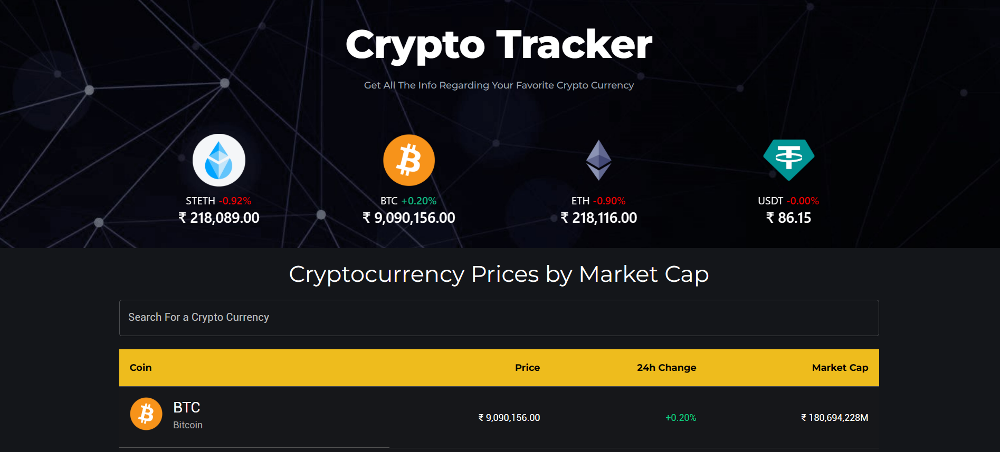

# 📈 CryptoTracker

A modern, responsive cryptocurrency tracking application built with React and powered by the CoinGecko API. Track real-time crypto prices, view detailed charts, and stay updated with the latest market trends.



## ✨ Features

- 🔍 **Real-time Cryptocurrency Data** - Live prices and market data from CoinGecko API
- 📊 **Interactive Charts** - Historical price charts with customizable time periods
- 🎠 **Trending Coins Carousel** - Showcase of the most popular cryptocurrencies
- 🔍 **Search & Filter** - Find your favorite cryptocurrencies quickly
- 💱 **Multi-Currency Support** - View prices in different fiat currencies
- 📱 **Responsive Design** - Optimized for desktop, tablet, and mobile devices
- 🎨 **Modern UI** - Clean, dark theme with smooth animations
- ⚡ **Fast Performance** - Built with Vite for lightning-fast development and builds

## 🛠️ Tech Stack

- **Frontend Framework:** React 18
- **Build Tool:** Vite
- **Styling:** Tailwind CSS
- **UI Components:** Material-UI (MUI)
- **Charts:** Chart.js with React Chart.js 2
- **Routing:** React Router DOM
- **HTTP Client:** Axios
- **Carousel:** React Alice Carousel
- **Icons & Animations:** Material-UI Icons

## 🚀 Getting Started

### Prerequisites

- Node.js (version 16 or higher)
- npm or yarn package manager

### Installation

1. **Clone the repository**
   ```bash
   git clone https://github.com/Aniket-sarbha/cryptotracker.git
   cd cryptotracker
   ```

2. **Install dependencies**
   ```bash
   npm install
   ```

3. **Start the development server**
   ```bash
   npm run dev
   ```

4. **Open your browser**
   Navigate to `http://localhost:5173` to view the application

### Build for Production

```bash
npm run build
```

The built files will be in the `dist` directory.

## 📁 Project Structure

```
src/
├── components/           # Reusable UI components
│   ├── Banner/          # Banner with carousel
│   │   ├── Banner.jsx
│   │   └── Carousel.jsx
│   ├── CoinInfo.jsx     # Individual coin information
│   ├── CoinsTable.jsx   # Cryptocurrency table
│   ├── Header.jsx       # Navigation header
│   └── SelectButton.jsx # Custom select button
├── pages/               # Page components
│   ├── HomePage.jsx     # Main landing page
│   └── CoinPage.jsx     # Individual coin details
├── config/              # Configuration files
│   ├── api.js          # API endpoints
│   └── data.js         # Static data
├── assets/             # Static assets
├── CryptoContext.jsx   # React Context for state management
├── App.jsx             # Main app component
└── main.jsx           # Application entry point
```

## 🔧 Available Scripts

- `npm run dev` - Start development server
- `npm run build` - Build for production
- `npm run preview` - Preview production build
- `npm run lint` - Run ESLint

## 🌐 API Integration

This project uses the [CoinGecko API](https://www.coingecko.com/en/api) to fetch:

- Live cryptocurrency prices and market data
- Historical price charts
- Trending cryptocurrencies
- Market statistics

## 🎨 Customization

### Styling
The project uses Tailwind CSS for styling. You can customize the theme by editing the `tailwind.config.js` file.

### Components
All components are modular and can be easily customized or extended. The main components include:

- **Header**: Navigation and branding
- **Banner**: Hero section with trending coins carousel
- **CoinsTable**: Paginated table of cryptocurrencies
- **CoinInfo**: Detailed coin information with charts

## 🤝 Contributing

1. Fork the repository
2. Create your feature branch (`git checkout -b feature/AmazingFeature`)
3. Commit your changes (`git commit -m 'Add some AmazingFeature'`)
4. Push to the branch (`git push origin feature/AmazingFeature`)
5. Open a Pull Request

## 📄 License

This project is licensed under the MIT License - see the [LICENSE](LICENSE) file for details.

## 🙏 Acknowledgments

- [CoinGecko](https://www.coingecko.com/) for providing the cryptocurrency API
- [React](https://reactjs.org/) for the awesome framework
- [Material-UI](https://mui.com/) for the beautiful components
- [Chart.js](https://www.chartjs.org/) for the charting capabilities

## 📞 Support

If you have any questions or need help with the project, please open an issue on GitHub.

---

**Happy Trading! 🚀💰**


